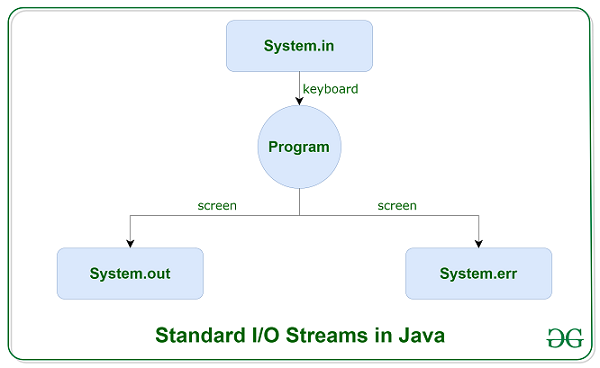
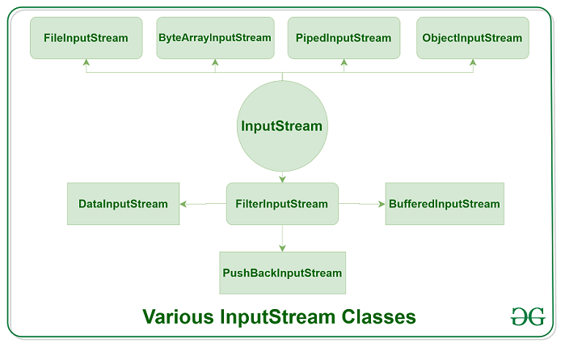
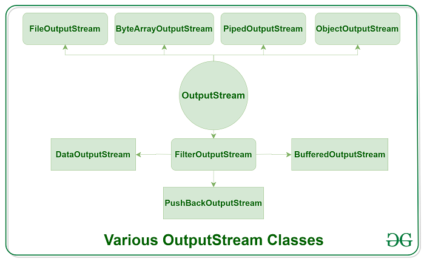
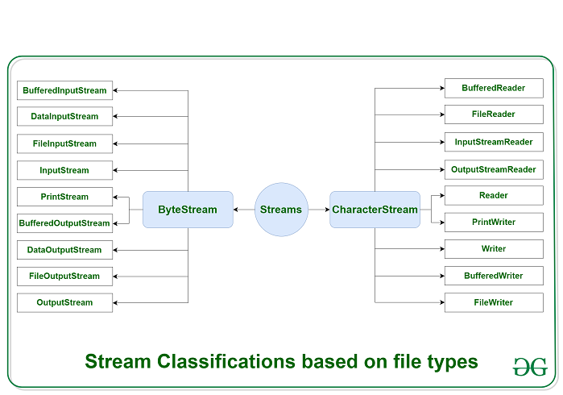

#Java IO : Input-output#

Java brings various Streams with its I/O package that helps the user to perform all the input-output operations.
 These streams support all the types of objects, data-types, characters, files etc to fully execute the I/O operations.
 
<b>

</b>

 
Le package<b> java.io </b>est composé de nombreuses classes, mais elles peuvent être réparties en 4 catégories, selon qu'elles réalisent des opérations :

* De lecture ou d'écriture
* Sur des données textuelles ou binaires

## Stream:
 These streams are used to write data as outputs into an array or file or any output peripheral device. For eg., FileOutputStream, BufferedOutputStream, ByteArrayOutputStream etc.
 

<b>Input Stream:</b> to read data from a source; it may be a file, an array, peripheral device or socket. 
-Classe abstraite est la super classe de toutes les classes représentant un flux d'entrée d'octets. Il existe plusieurs façons de lire le contenu d'un fichier en utilisant InputStream en Java
  
 
 
<b>Output Stream:</b> These streams are used to write data as outputs into an array or file or any output peripheral device. 
 

<b>Depending on the types of file</b> Streams can be divided into two primary classes which can be further divided into other classes as can be seen through the diagram below followed by the explanations.
 
